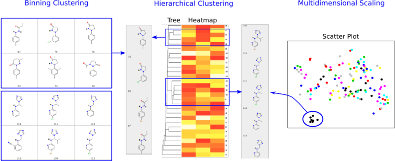

# Clustering and Data Mining

Clustering of compounds by structural and physicochemical similarities is a powerful approach for correlating structural features of compounds with their activities. ChemMine Tools provides facilities for binning clustering, hierarchical clustering and multidimensional scaling (MDS). The required distance matrices for hierarchical and MDS clustering are calculated by all-against-all comparisons of compounds using atom pair similarity measures (see above) and transforming the generated similarity scores into distance values. The resulting trees and scatter plots are presented as interactive plots generated with the CanvasXpress javascript library. Trees and scatter plots can be zoomed and panned, and clicking a compound CID will pop-up a box with the compounds structure and a link to the compounds details page. The tree viewing tool can also plot heatmaps of generated physicochemical properties or data uploaded with the Upload Numeric Data link. This is useful for showing custom data like bioactivity information from HT screens in form of heatmaps next to the hierarchical clustering results.
