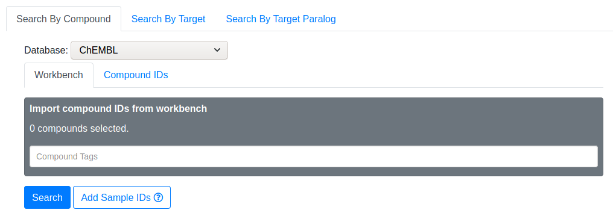
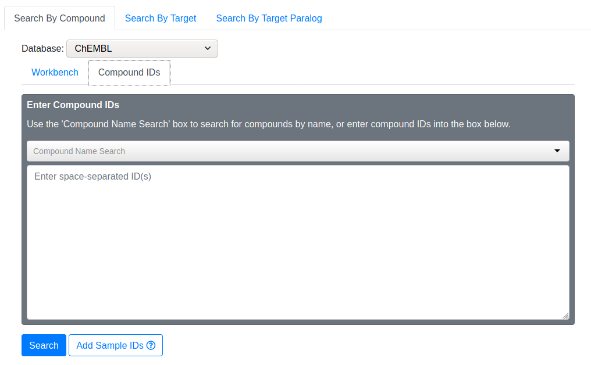
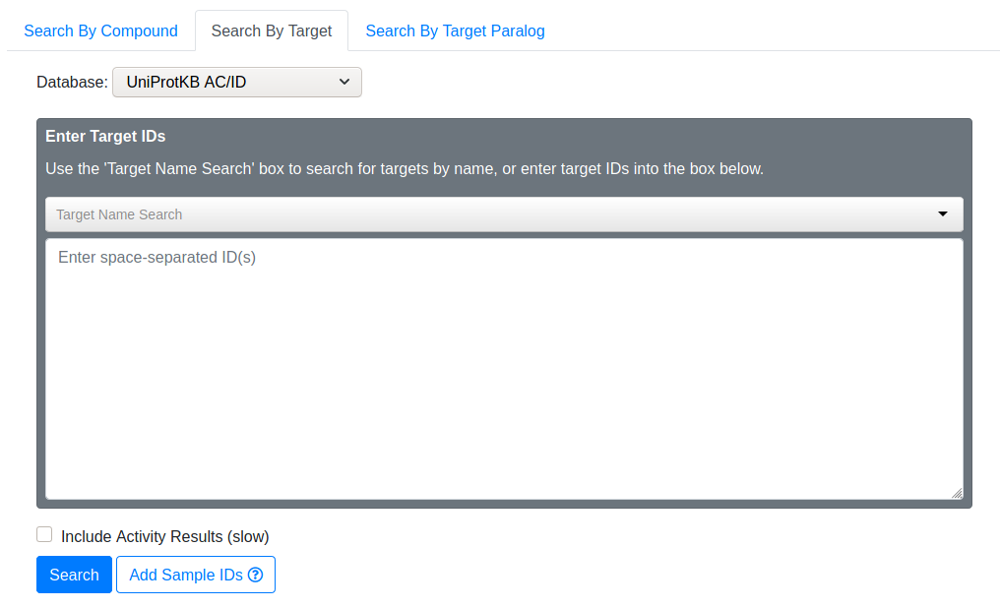
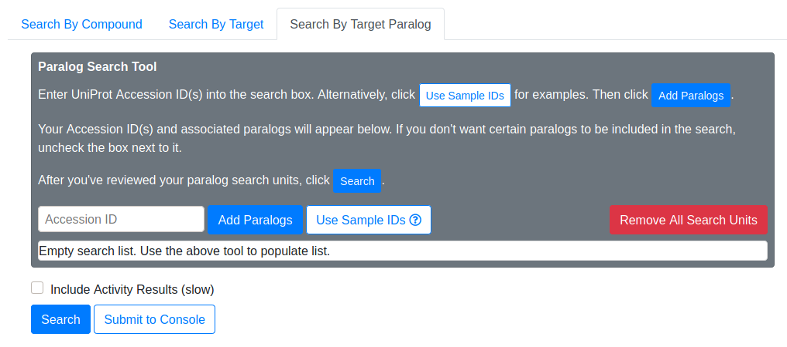
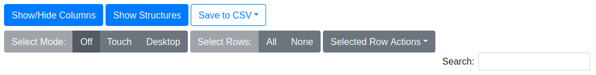

# Drug-Target Search

Drug-Target Search utilizes the ChEMBL database to query relationships between
small drug-like molecules and protein targets. There are currently 3 types of
searches:

1. Search By Compound
2. Search By Target
3. Search By Target Paralog

## Search By Compound

In this type of search, you provide one or more drug molecules (usually
ChEMBL IDs), and Drug-Target Search will return a list of proteins that the
drug is known to target.

#### Database

By default, Drug-Target Search expects ChEMBL IDs when searching by compound.
If you need to use other types of IDs (e.g. PubChem), you may change the
database type, and ChemMine Tools will translate your IDs via the UniChem
service.

#### Workbench

Instead of manually inputting compounds, you may retreive compounds from your
Workbench using the tag system.

#### Compound IDs

Use this to manually input compound IDs. You may search for compounds by typing
its name into the "Compound Name Search" area. The search box will offer
suggestions as you type. If you notice your desired compound, select it and
the corresponding ChEMBL ID will be added to your search IDs.

#### Sample IDs

For demonstration purposes, select "Use Sample IDs" to fill the compound ID
box with some example ChEMBL IDs. Then click "Search" to continue.

## Search By Target

In this type of search, you provide one or more protein targets (usually
UniProt IDs), and Drug-Target Search will return a list of drug molecules that
are known to act on the targets. This search mode is essentially the inverse of
Search By Compound.

#### Database

By default, Drug-Target Search expects UniProt IDs when searching by target. If
you need to use other types of IDs (e.g. Ensembl), you may change the database
type, and ChemMine Tools will translate your IDs via the UniProt service.

#### Target IDs

Use this to manually input target IDs. You may search for targets by typing its
name into the "Target Name Search" area. The search box will offer suggestions
as you type. If you notice your desired target, select it and the corresponding
UniProt ID will be added to your search IDs.

#### Sample IDs

For demonstration purposes, select "Use Sample IDs" to fill the target ID box
with some example UniProt IDs. Then click "Search" to continue.

#### Include Activity Results

TODO

## Search By Target Paralog

This mode is a variation of Search By Target, and is done in two steps. In the
first step, you provide one or more protein targets (usually UniProt IDs), and
Drug-Target Search will expand your query by finding paralogs of your provided
targets. In the second step, Drug-Target Search performs essentially the same
lookup as Search By Target.

#### Paralog Search Tool

Searching paralogs is the first step in Search By Target Paralog. You provide
UniProt Accession IDs, and Drug-Target Search uses the Ensembl Biomart service
to find paralogs of your original IDs. After entering your IDs and clicking
"Add Paralogs", the paralogs of your original IDs will appear in the below
search list.

#### Sample IDs

For demonstration purposes, select "Use Sample IDs" to fill the Accession ID
box with some example UniProt IDs. Then click "Add Paralogs" to continue.

#### Search List

This search list shows the paralogs of your original IDs. The list is
organized as units. A search unit comprises the original ID, and its associated
paralogs. If you want to exclude certain paralogs from the target search,
uncheck the box next to it. If you want to remove an entire search unit, click
the trash icon on the right-hand side.

## Result Tables

#### By Annotation

TODO

#### By Activity

TODO

### Table Features

#### Show/Hide Columns

TODO

#### Show/Hide Structures

Toggles the visibility of the compound structure. If visible, the structure
will be placed underneath the ChEMBL ID in each row.

#### Save to CSV

Exports the result table to a file in comma-separated value (CSV) format for
use in other applications. You may export all columns, or only the visible
columns, to the CSV file.

#### Select Mode

Controls the row selection style of the result table. "Off" disables manual
selection actions entirely. "Touch" mode is ideal for touchscreen devices. In
this mode you select/deselect rows by clicking/touching them individually.
Selecting a different row does not deselect previous rows. "Desktop" mode
mimicks a traditional desktop file manager. In this mode, only one row may be
selected by a mouse click. Multiple individual rows may be selected by holding
Ctrl while clicking rows, and a range of rows may be selected by holding Shift
while clicking the first and last row of the desired range.

#### Select Rows

"All" automatically selects all rows in the table (including those not on the
current page). "None" automatically deselects all rows. This behavior is
irrespective of the Select Mode.

#### Selected Row Actions

##### Add Compounds to Workbench

Add compounds from selected rows to the ChemMine Tools workbench. Selected
compounds will be checked for duplicates/database availability before being
committed to workbench.

##### Add Compound IDs to Search

Add ChEMBL IDs from selected rows to the Compound IDs search box. Selected
compounds will be deduplicated before being added to the search.

##### Add Accession IDs to Search

Add Accession IDs from selected rows to the Target IDs search box. Selected
Accession IDs will be deduplicated before being added to the search.

#### Search box

Perform a text search on the result table. The search spans all columns and
progressively searches as you type.
