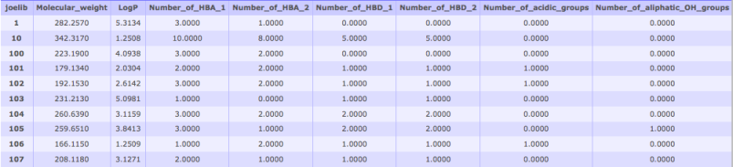

# Molecular Property Predictions

Molecular descriptors provide quantitative information about chemical properties of compounds. They can be very useful for prioritizing lead compounds, property clustering and QSAR analyses. Currently two property computing tools are provided- JOELib and Open Babel. The Open Babel tool computes the descriptors currently supported by the Open Babel software library. The JOELib tool computes 38 descriptors for each compound, which are described in detail here: JOELib site. After calculating molecular descriptors these data can be selected as input for various clustering jobs. To cluster based on properties, or plot a heatmap of your properties alongside a structural clustering tree: start a clustering job, and select your completed properties job from the drop-down menu.
