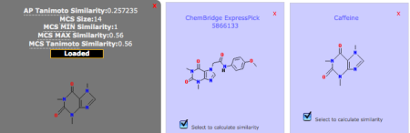

# Similarity Comparisons

Similarity scores between compound pairs can be computed with the Similarity Workbench. The interface calculates atom pair and maximum common substructure (MCS) similarities with the Tanimoto coefficient as the similarity measure (Chen & Reynolds, 2002; Cao et al. 2008). The MCS tool identifies the largest substructure two compounds have in common (Fig. 3). Please note that the similarity measures provided by the Similarity Toolbox (MCS and AP) differ from PubChem fingerprint similarity, as used in the Search Toolbox. For more details, please see the theory section at the end of this tutorial.
